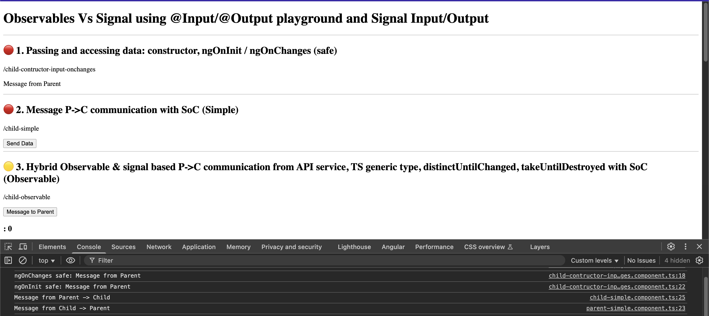

# Angular (19+) Observables Vs Signal using @Input/@Output playground and Signal Input/Output 🔊

## Demo



---

## Modern practices latest final signal-based API is implementing 🚀

```js
✅ @NgModule  → Standalone component
✅ *ngFor, *ngIf  → Modern control flow: @if, @for
✅ Parent emits updates through writableSignal() following the Modern `Signal-Based Component Architecture Pattern` (Service (Shared State) ←→ Parent (Local State) ←→ Child (Pure Input))
✅ ngOnInit() + subscribe() + contructor based inject → Use reactive Signals + computed() 
✅ contruct-based DI injection → inject(HttpClient) 
✅ Better Ts notation → Protected + readonly template properties for protection and mutability control
✅ Two-Way Binding (Old Way) → signal-input-pattern 
```

---

## NOTES:
> When passing values from a P -> C component using the `@Input`, `these values are not available in the constructor` = Avoids running Angular-specific logic or accessing @Input properties, as they are not yet set.

> If you need to react to changes in @Input values beyond initialization, consider using the `ngOnChanges()` lifecycle hook

### constructor()
- Called first, before any Angular lifecycle hooks.
- Used to initialise the component instance.
- Runs before Angular has fully initialized the component.
- `Not safe access @Input values`

### ngOnInit()
- called after the constructor, after the first ngOnChanges()
- `Safe for access @Input` values
- Runs after the constructor and after Angular sets up the component's bindings.

---

### :100: <i>Thanks!</i>
#### Now, don't be an stranger. Let's stay in touch!

<a href="https://github.com/leolanese" target="_blank" rel="noopener noreferrer">
  
</a>

##### :radio_button: Linkedin: <a href="https://www.linkedin.com/in/leolanese/" target="_blank">LeoLanese</a>
##### :radio_button: Twitter: <a href="https://twitter.com/LeoLanese" target="_blank">@LeoLanese</a>
##### :radio_button: DEV.to: <a href="https://www.dev.to/leolanese" target="_blank">Blog</a>
##### :radio_button: Questions / Suggestion / Recommendation: developer@leolanese.com
