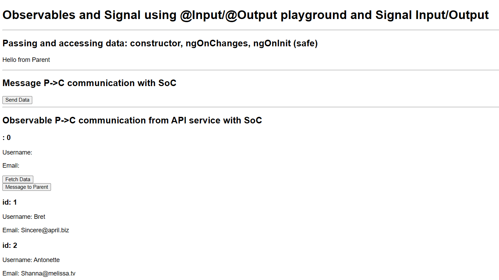

# Angular (19+) Observables and Signal using @Input/@Output playground and Signal Input/Output

## Demo



```js
- /`child-contructor-input-onchanges`
Accessing passed values from contructor() (not safe), @Input() and ngOnChanges() with SoC

- /`child` 
passing P <-> C @Input/@Output with SoC

- Child-observable: Passing Observable from P -> C + Reusable Generic Service
```

---

## NOTES:
> When passing values from a P -> C component using the `@Input`, `these values are not available in the constructor` = Avoids running Angular-specific logic or accessing @Input properties, as they are not yet set.

> If you need to react to changes in @Input values beyond initialization, consider using the `ngOnChanges()` lifecycle hook

### constructor()
- Called first, before any Angular lifecycle hooks.
- Used to initialise the component instance.
- Runs before Angular has fully initialized the component.
- `Not safe access @Input values`

### ngOnInit()

- called after the constructor, after the first ngOnChanges()
- `Safe for access @Input` values
- Runs after the constructor and after Angular sets up the component's bindings.

---

## @for instead *ngFor()

> The key difference is that `@for` loops over the array value directly, while `*ngFor` gives you the array element value.

Feature: Syntax
- `ngFor`: `*ngFor="let item of items"`
- `@for`: `@for="let i from X to Y"`


```js
// instead of
<ul>
  <li *ngFor="let suggestion of suggestions">{{ suggestion }}</li>
</ul>

// better do
<ul>
  @for (let suggestion of suggestions) {
    <li>{{ suggestion }}</li>
  }
</ul>
```

## @for with | async pipe

```js
// instead
<div *ngIf="users$ | async as users; else loading">
  <app-dummy 
     *ngFor="let user of users" 
     [user]="user" 
     (fetchDataEvent)="fetchData()"
  />
</div>
<ng-template #loading><h2>Loading...</h2></ng-template>  

// better do
@for(user of users$ | async; track user){
    <app-dummy 
        [user]="user" 
        (fetchDataEvent)="fetchData()"
    />
} @empty {
    <h2>Loading...</h2> 
}
```

## @for with $index

```js
@Component({
    template: `
        @for(fruit of fruits; track fruit; let index = $index) {
            <div>{{ fruit }} {{ index }}</div>
        }

    `,
})
export class FruitComponent {
    fruits = ['apple', 'lemon'];
}
```

## @for with $first and $last

```js
@Component({
    template: `
        @for(fruit of fruits; track fruit; let first = $first, last = $last) {
            <div>First: {{ first }}: Last {{ last }}</div>
        }
    `,
})
export class FruitComponent {
    fruits = ['apple', 'lemon'];
}

// <div>First: true: Last false</div>
// <div>First: false: Last true</div>
```

---

### :100: <i>Thanks!</i>
#### Now, don't be an stranger. Let's stay in touch!

<a href="https://github.com/leolanese" target="_blank" rel="noopener noreferrer">
  
</a>

##### :radio_button: Linkedin: <a href="https://www.linkedin.com/in/leolanese/" target="_blank">LeoLanese</a>
##### :radio_button: Twitter: <a href="https://twitter.com/LeoLanese" target="_blank">@LeoLanese</a>
##### :radio_button: DEV.to: <a href="https://www.dev.to/leolanese" target="_blank">Blog</a>
##### :radio_button: Questions / Suggestion / Recommendation: developer@leolanese.com
